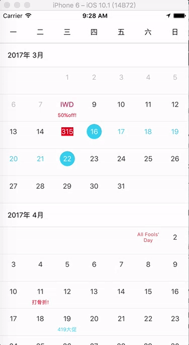

# RN-calendar
A react-native calendar

## Features
1. Date Range select;
2. custom render;
3. holiday date and note data support;

## screenshoot

  

## Usage
```
npm install react-native-range-calendar --save
```

## Demo
``` javascript
class CalendarDemo extends Component {

    state = {
        selectedDate: ['2017-03-30', '2017-04-09']
    }

    render() {
        return (
            <View style={{flex: 1, backgroundColor: '#fff', paddingTop: 20}}>
                <Calendar
                    showDateRange={['2017-03-03', '2017-11-11']}
                    enableDateRange={['2017-03-08', '2017-10-22']}
                    selectedDate={this.state.selectedDate}
                    onChange={(value) => { alert(JSON.stringify(value))}}
                    renderDate={(param = {}) => {
                        const { selected, innerSelected, date, text, disable } = param;
                    }}
                    holiday={{
                        '2017-03-08': {text: 'IWD', textStyle: {color: '#cf087b'}},
                        '2017-03-15': {text: '315', textStyle: {color: '#fff', backgroundColor:'#ff0000' }},
                        '2017-04-01': {text: `All Fools' Day`, textStyle: {fontSize: 10, textAlign: 'center', color: '#ef473a'}},
                        '2017-05-01': {text: '劳动节', textStyle: {color: '#ef473a'}},
                        '2017-06-01': {text: '儿童节', textStyle: {color: '#ef473a'}}
                    }}
                    note={{
                        '2017-03-08': {text: '50%off!', textStyle: {color: '#ff0000'}},
                        '2017-04-19': {text: '419大促', textStyle: {color: '#11c1f3'}},
                        '2017-04-11': {text: '打骨折!', textStyle: {color: '#ff0000'}}
                    }}
                />
            </View>
        );
    }
}
```

### Props

```javascript
    /**
     * the default selected value
     * like this: ['2017-03-30', '2017-04-09']
     * @type {[Array]}
     */
    selectedDate: PropTypes.array,

    /**
     * calendar range. Actually ,the calendar will display full month.
     * example: if showDateRange is ['2017-03-08', '2017-11-11'], the calendar render the month from 03 to 11, the date include 2017-03-01 and 2017-11-31
     * @type {[Array]}
     */
    showDateRange: PropTypes.array,

    /**
     * the enabled range , this value must belong to the showDateRange Array, it's the sub collection.
     * @type {[Array]}
     */
    enableDateRange: PropTypes.array,

    /**
     * enabled range select, default value is true;
     * if the value is false, you can select one date only.
     * @type {Boolean}
     */
    isRange: PropTypes.bool,

    /**
     * enabled the LayoutAnimation. default is true
     * @type {[Boolean]}
     */
    animate: PropTypes.bool,

    /**
     * holiday data extentions
     * example: {'2017-12-25', {text: 'Christmas', textStyle: {color: 'red'}}}
     *
     * @type {[object]}
     */
    holiday: PropTypes.object,

    /**
     * the note text , it is under the date text.
     * example: {'2017-12-25', {text: '🎄', textStyle: {}}}
     * @type {[object]}
     */
    note: PropTypes.object,

    /**
     * the calendar header renderer, normaly, it is monday to sunday.
     * @type {[Function]}
     */
    renderHeader: PropTypes.func,

    /**
     * the header of each month renderer.
     * @param object
     * @type {[Function]}
     */
    renderMonthHeader: PropTypes.func,

    /**
     * you can get a param, and costom render the date cell
     * @param object. the param is shape of { selected, innerSelected, date, text, disable }
     * @type {[Function]}
     */
    renderDate: PropTypes.func,

    /**
     * event， when you change the selected date
     * @param date|String, info|object, event|Object
     * @type {[Function]}
     */
    onChange: PropTypes.func,

    /**
     * when you press the date cell, it will be fired enven if the date is disabled.
     * @param dayInfo|object, event|Object
     * @type {[Function]}
     */
    onPress: PropTypes.func

```
